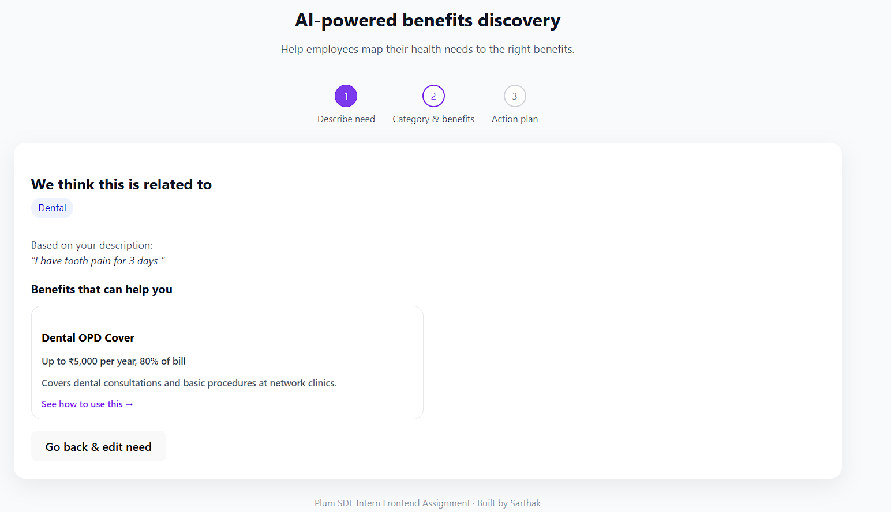

# AI-Powered Benefits Discovery Flow

Frontend assignment for **Plum – SDE Intern** role.

This project helps employees understand **which health benefit applies to their problem** and explains **how to use it**, using an AI-powered, step-based flow.

---

## 🚀 What does this project do?

Employees often describe health issues in simple language but don’t know:
- which benefit applies
- how to actually use that benefit

This app solves that problem in **3 simple steps**:

1. User describes their health concern in free text
2. AI classifies the concern into a benefit category
3. App shows relevant benefits and generates a clear action plan

---

## 🧭 Application Flow (with UI)

### Step 1 – Describe the problem


User enters a health concern like:
> “I have tooth pain for 3 days”

---

### Step 2 – Category & benefits


The app:
- Detects the benefit category (Dental / Mental Health / Vision / General Health)
- Shows benefit cards with coverage information

---

### Step 3 – Action plan


When a benefit is selected, the app generates:
- A **3-step practical action plan**
- Clear instructions on how to use the benefit

---

## 🛠️ Tech Stack

- **React + TypeScript**
- **Vite** (fast dev environment)
- **React Context API** (global state management)
- **Mock AI service** (simulates LLM-based classification)
- CSS for styling

---

## 📂 Project Structure

```txt
src/
 ├─ pages/          # Step-wise screens
 ├─ components/     # Reusable UI components
 ├─ context/        # Global flow state
 ├─ services/       # Mock AI classification logic
 ├─ types/          # TypeScript types
 ├─ App.tsx         # App shell & step navigation
 └─ App.css         # Styling
